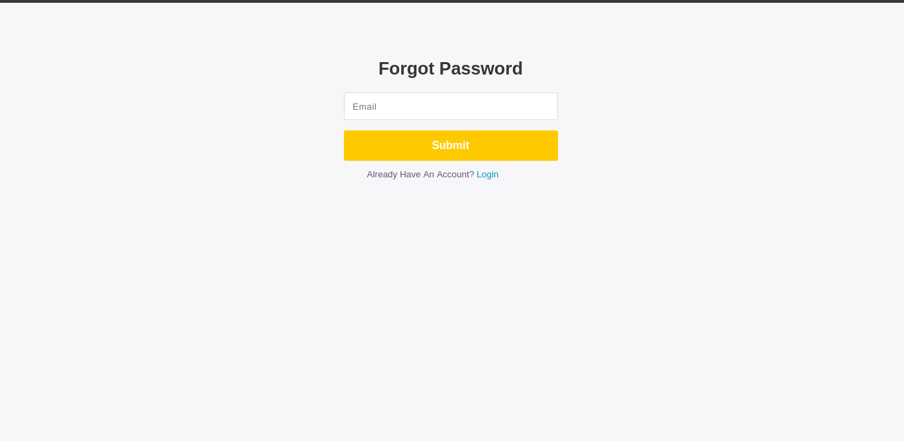
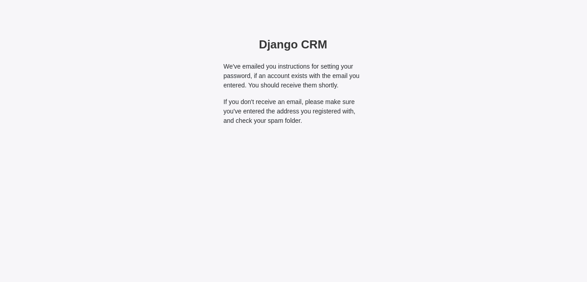
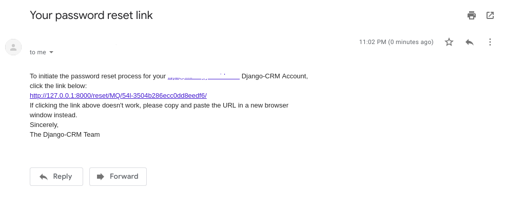
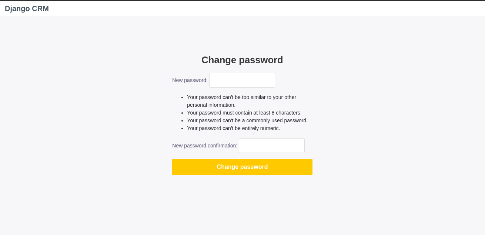
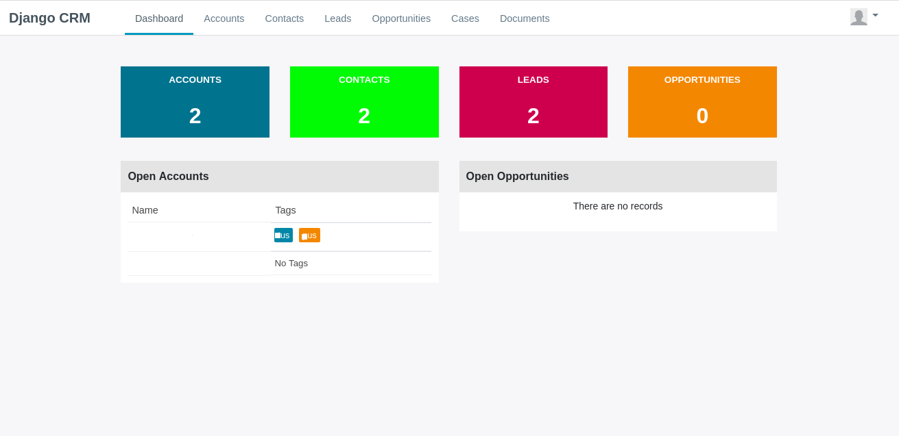

Forget Password
***************

|  **Fig** Forget Password Page View

|  Enter the registered email id and click submit, then you will be sent a email to the registered email address, and redirect to the acknowledge page as below figure

|  **Fig** Email Sent acknowledgement view

|  When you check the mail you will recieve a email similar to the below figure.

|  **Fig** Email recieved

|  When you click on the link in the mail, you will get a page as below

|  **Fig** Password Reset view

|  After you successful change the password you will get below page

.. image:: screenshots/resetsuccessful.png

|  **Fig** Password Reset Successful view

|  Now click on login and enter your credentials

|  After successful login you will be redirected to Dashboard which looks similiar to the below figure

|  **Fig** Dashboard view

|  The home page/Dashboard have access to all the modules of the CRM

|  **Note:** The numbers below accounts, contacts, leads, opportunities represent the total count of each module.