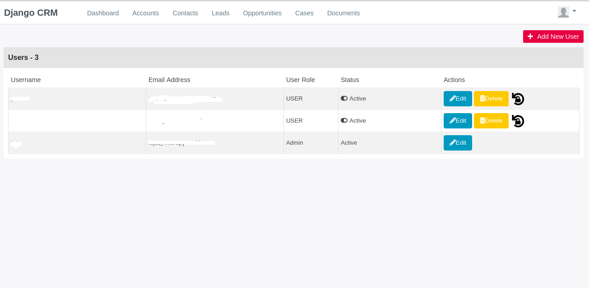
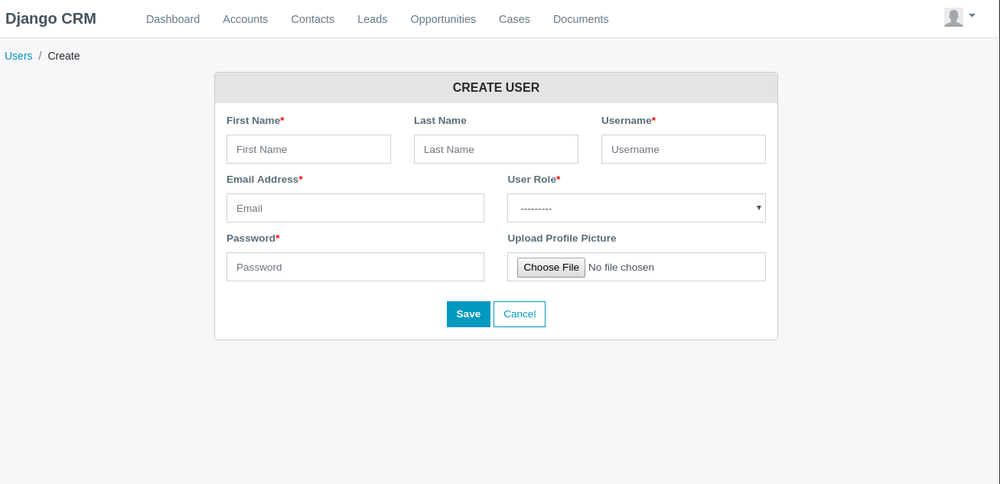
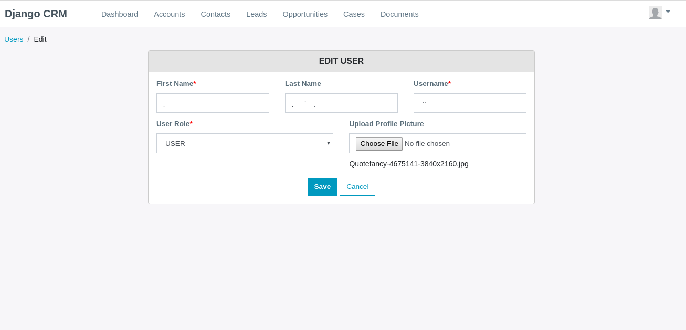
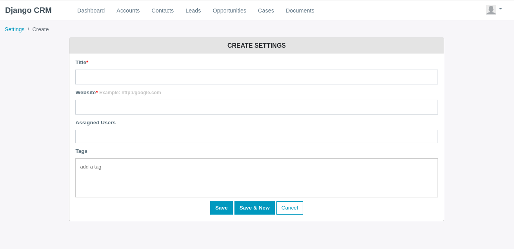
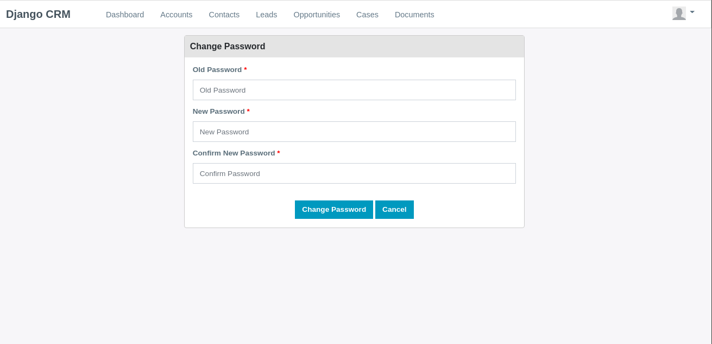
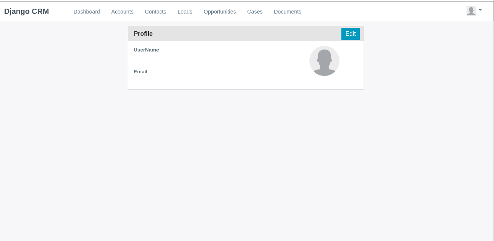
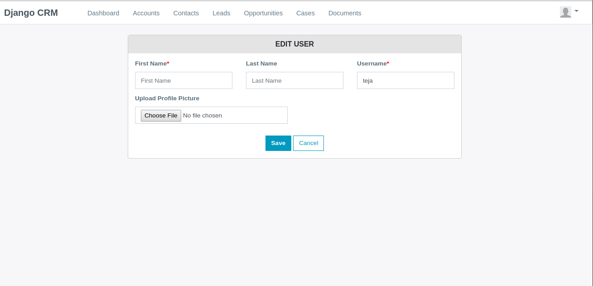

Profile
*******

Dropdown menu for user settings

.. image:: screenshots/dropdown.png
	:align: center

|  **Fig** Dropdown menu

Here in this drop down all the essential options for the user profile management are available i.e.

Users
~~~~~

|  On clicking users, the following page is shown

|  **Fig:** Users view

|  Here the user can activate/deactivate, edit/delete user data.

|  To create new user click on `` + Add New User``.

|  One clicking `` + Add New User`` the following page is shown:

|  **Fig** User create page

|  **Note:** Fields having ``*`` are mandatory.

|  **Fig:** User Edit User page

Settings
~~~~~~~~~
|  On clicking settings, the following page is shown:

.. image:: screenshots/settingshome.png
	:align: center

|  **Fig:** User Settings page

|  Click on `` + Add New Setting``

|  **Fig:** User Create Setting page

Change Password
~~~~~~~~~~~~~~~

|  On clicking settings, the following page is shown:

|  **Fig:** User Change password page

Profile
~~~~~~~

|  On clicking settings, the following page is shown:

|  **Fig:** User profile page

|  **Fig:** User edit profile page

|  Here user can edit his personal details.

Logout
~~~~~~~
On Clicking logout you will be logged out from the account and redirected to Login page.